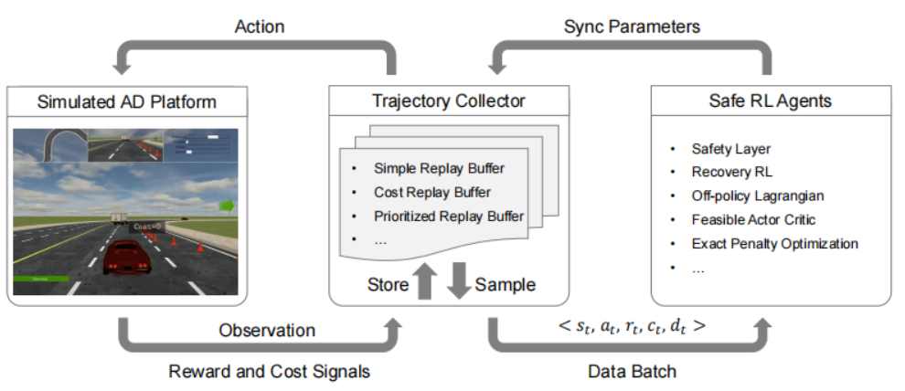

# Saferl kit: Evaluating Efficient Reinforcement Learning Methods for Safe Autonomous Driving

TD3| EPO | LAG
:-------:|:--------:|:-------:
  |  |  

FAC| REC | QPSL
:-------:|:--------:|:-------:
  |  |  

## Description

Safe_RL kit is a toolkit for benchmarking efficient and safe RL methods for autonomous driving tasks ，which consists of the following sections：

-  Implement several of the state-of-the-art (SOTA) safe RL algorithms ：
     -  [Safe Exploration in Continuous Action Spaces](https://arxiv.org/pdf/1801.08757.pdf)
     -  [Recovery RL:Safe Reinforcement Learning with Learned Recovery Zones](https://arxiv.org/pdf/2010.15920.pdf)
     -  [Learning to Walk in the Real World with Minimal Human Effort](https://arxiv.org/pdf/2002.08550.pdf?utm_source=yxnews&utm_medium=desktop&utm_referrer=https%3A%2F%2Fyandex.uz%2Fnews)
     -  [Feasible Actor-Critic: Constrained Reinforcement Learning for Ensuring Statewise Safety](https://arxiv.org/pdf/2105.10682.pdf)
     -  In addition , we use the standard TD3 as the base RL algorithm ,  all algorithms  are implemented under off-line way  , which is 10-20 times sample-efficient than the prior benchmarking： [Benchmarking Safe Exploration in Deep Reinforcement Learning](https://www.semanticscholar.org/paper/Benchmarking-Safe-Exploration-in-Deep-Reinforcement-Achiam-Amodei/4d0f6a6ffcd6ab04732ff76420fd9f8a7bb649c3)

-  we propose a novel first-order method Exact Penalty Optimization (EPO) ：
     - EPO utilizes a single penalty factor and the ReLU operator to construct an equivalent unconstrained objective. Empirical results show the simple technique is surprisingly effective and well-performed for AD-oriented tasks.

## Repository Structure

The repository is organized as follows：

`/metadrive`   the safe-rl environment for the car-driving, which are implement by [metadrive](https://github.com/metadriverse/metadrive)  .    

`/bullet_safety_gym` the safe-rl environment for the car speed control,which are implement by [Bullet-Safety-Gym](https://github.com/SvenGronauer/Bullet-Safety-Gym) .

`/safe_algo` ：this folder defines  the whole reinforcements learning algorithms used in this repository . All algorithms are implemented based on TD3 structure. The class structure of all methods is the same and the only differences are the implementation of methods in these classes.  

`/saferl_utils`：This folder defines the empirical playback pool and network structure for all algorithms.  corresponding to the folder `safe_algos`，`networks.py`define all the networks used in this repository,which are based on the TD3 structure，using 2 hidden layers which has 256 unit per layer as the net-architecture,the replay buffer used in the off-policy are defined in the `replay_buffer.py`.

`/safety_plotter`：This folder defines the settings about logging files and drawing pictures. 

`plot.py` plot the picture using files which generated by logger.

`train_metadrive.py` ： The main script for running experiments in metadrive, which parses command-line arguments from the user .

## Installation and Setup

To install the dependencies，use the command line 

`pip instal -r requirements.txt`

## Running Experiments

We can run and test all the safe reinforcement learning algorithms and two environments involved in the framework by using the following command line:  

`python main.py --use_td3 --env SafetyCarRun-v0  --save_model  --exp_name td3 --seed 0 --loop 5 --device 1 --max_timesteps 1000000`

We can use all the algorithms defined in this article in a manner similar to `--use_td3`, which is shown in the `train_metadrive.py` file;  Also, we can set the environment to be used in this experiment by setting `--env env_name`. Currently, `SafeMetaDriveEnv` and `SafetyCarrun-v0` are supported. In addition, we can also customize the environment by customizing gym environment.  

## Showing Results

we can see the algorithm result by drawing the logs which generated by the logger, will be placed at `/logs` in default.

use the following command line in the root folder to draw the result.

`./plot.sh`

this will draw the `episode reward`,`episode cost`,`cost rate` in sequence.
