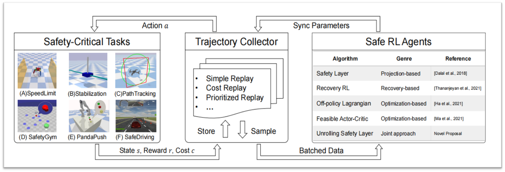

### Author's Implementation of SafeRL-Kit (AAAI 2023)



#### Updates:

The paper *Evaluating Model-free Reinforcement Learning toward Safety-critical Tasks* has been accepted by AAAI 2023 Safe and Robust AI Track.

In the new version, we propose a novel method Unrolling Safety Layer (enhancing the old version's EPO) and conduct extensive studies on six different benchmarks (instead of autonomous driving only).

The old version (SL4AD workshop in ICML 2022) for safe AD can still be found at  the SL4AD@ICML22 branch.

#### Tutorial for Stabilization task

The env is based on safe-control-gym (Yuan et al. 2021), which needs two additional command line parameters, namely --task and --overrides.

- Train Safe RL Agents

```bash
python train_stabilization.py --task cartpole --overrides saferl_envs/config_overrides/stable_task.yaml --use_{XXX}

# --use_usl for Unrolling Safety Layer (Ours)
# --use_qpsl for QP Safety Layer (Dalal et al. 2018)
# --use_recovery for Recovery RL (Thananjeyan 2021)
# --use_lag for Off-policy Lagrangian (Ha 2021)
# --use_fac for Feasible Actor-Critic (Ma 2021)
# --use_td3 for unconstrained RL
```

- Plot the results

```bash
./plot.sh
```

- Note:  

> --task quadrotor -- overrides saferl_envs/config_overrides/traj_task.yaml

for PathTracking task.

#### Tutorial for SpeedLimit task

Train Safe RL Agents

```bash
python train_speedlimit.py --use_{XXX}

# --use_usl for Unrolling Safety Layer (Ours)
# --use_qpsl for QP Safety Layer (Dalal et al. 2018)
# --use_recovery for Recovery RL (Thananjeyan 2021)
# --use_lag for Off-policy Lagrangian (Ha 2021)
# --use_fac for Feasible Actor-Critic (Ma 2021)
# --use_td3 for unconstrained RL
```

Plot the results

```bash
./plot.sh
```

#### Tutorial for SafeDriving task

switch to the SL4AD@ICML22 branch

#### Issues

we have included related envs in this repo, so

`pip uninstall safe_control_gym/safety_gym/xxx` if a version conflict has occurred.


